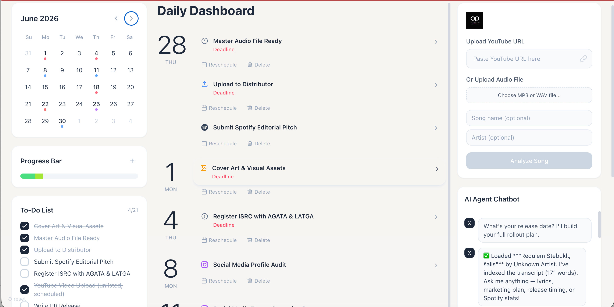

# DropOperator — AI-Powered Music Release Planner

> Load a song from YouTube or upload an audio file. Get a full release plan, Spotify editorial pitch, radio emails, social media content, and more — generated by an AI agent that knows the music industry.

---

## What It Does

Independent musicians often release music without a marketing strategy. DropOperator fixes that by combining transcript analysis, machine-learning genre detection, and a LangGraph ReAct agent backed by a curated music-industry knowledge base. The result is a complete, dated release checklist that syncs to a visual calendar and task board — with a per-task creative assistant ready to write pitches, captions, and press releases on demand.

---

## Live Demo

| Service | URL |
|---|---|
| Frontend | https://music-ai-chat.vercel.app |
| Backend API | Render (free tier — see deployment notes below) |

> The live deployment is fully functional. Genre detection in the deployed version uses **librosa** instead of Essentia due to Render free tier CPU constraints. For the full Essentia-powered 400-class genre classification, run the project locally.



---

## Tech Stack

### Backend
| Layer | Technology |
|---|---|
| Runtime | Python 3.11 |
| API framework | FastAPI 0.136 + Uvicorn |
| AI agent | LangGraph `create_react_agent` + LangChain |
| Primary LLM | xAI Grok (`grok-4.3`) via OpenAI-compatible endpoint |
| Secondary LLM | OpenAI GPT-4o / GPT-4o-mini |
| Embeddings | OpenAI `text-embedding-3-small` |
| Vector DB | Pinecone Serverless (namespaced per video + `marketing_knowledge`) |
| Genre detection | Essentia TensorFlow models (Discogs-EffNet + 400-class classifier) |
| Transcription | AssemblyAI REST API (`universal-2` speech model) |
| YouTube transcripts | `youtube-transcript-api` + `yt-dlp` |
| Database | Supabase (Postgres) via `supabase-py` |
| Memory | LangGraph `InMemorySaver` (per-session conversation memory) |
| Spotify API | `spotipy` (client credentials flow) |

### Frontend
| Layer | Technology |
|---|---|
| Framework | Next.js 14 (App Router) |
| Language | TypeScript |
| Styling | Tailwind CSS |
| State | React hooks (`useState`, `useCallback`, `useEffect`) |
| HTTP | Native `fetch` |
| Date utilities | `date-fns` |

---

## Architecture

```
┌──────────────────────────────────────────────────────────────────┐
│                        FRONTEND (Next.js)                        │
│                                                                  │
│  UploadPanel ──► POST /analyze or /analyze-audio                 │
│  AIChatbot ────► POST /chat ──────────────────────────────────┐  │
│  EventDrawer ──► POST /event-chat                             │  │
│  DailyFeed ────► GET/PATCH/DELETE /calendar/events/{id}       │  │
│  TodoListPanel ► GET/PATCH /todos/{session_id}                │  │
└───────────────────────────────────┬──────────────────────────┘  │
                                    │ REST (JSON)                  │
┌───────────────────────────────────▼──────────────────────────────┐
│                      BACKEND (FastAPI)                           │
│                                                                  │
│  main.py                                                         │
│  ├── /analyze ──► pipeline.py ──► youtube-transcript-api        │
│  │                             ──► yt-dlp → AssemblyAI fallback │
│  │                             ──► Pinecone embed (namespace:   │
│  │                                 video_{video_id})            │
│  │                                                              │
│  ├── /analyze-audio ──► AssemblyAI upload + poll               │
│  │                   ──► Essentia genre_detect.py              │
│  │                   ──► Pinecone embed                        │
│  │                                                             │
│  ├── /chat ──► agent.py (LangGraph ReAct)                      │
│  │             ├── _build_system_prompt() injects genre data   │
│  │             ├── run_agent() → ainvoke()                     │
│  │             ├── extract_tasks_from_response() → GPT-4o-mini │
│  │             └── TOOLS:                                      │
│  │                 ├── search_transcript        (Pinecone RAG) │
│  │                 ├── extract_lyrics           (GPT-4o-mini)  │
│  │                 ├── analyze_marketing_potential (Grok)      │
│  │                 ├── get_artist_info          (Spotify API)  │
│  │                 ├── find_release_timing      (GPT-4o)       │
│  │                 └── search_marketing_knowledge (Pinecone)   │
│  │                                                             │
│  ├── /event-chat ──► Pinecone knowledge search                 │
│  │                ──► Pinecone transcript fetch                │
│  │                ──► Grok completion                          │
│  │                                                             │
│  └── /calendar/*, /todos/*, /session/* ──► Supabase Postgres   │
│                                                                 │
└─────────────────────────────────────────────────────────────────┘
                    │                          │
         ┌──────────┴──────────┐    ┌─────────┴─────────┐
         │   Pinecone          │    │   Supabase         │
         │  ┌───────────────┐  │    │  ┌──────────────┐  │
         │  │ video_{id}    │  │    │  │calendar_     │  │
         │  │ (transcript   │  │    │  │events        │  │
         │  │  chunks)      │  │    │  ├──────────────┤  │
         │  ├───────────────┤  │    │  │todos         │  │
         │  │ marketing_    │  │    │  └──────────────┘  │
         │  │ knowledge     │  │    └────────────────────┘
         │  │ (512 chunks)  │  │
         │  └───────────────┘  │
         └─────────────────────┘
```

---

## Features

- **YouTube URL analysis** — fetches official captions via `youtube-transcript-api`; falls back to AssemblyAI Whisper transcription if captions are unavailable
- **Audio file upload** — accepts MP3/WAV/M4A/OGG/FLAC; transcribes via AssemblyAI and detects genre via Essentia
- **ML genre detection** — Essentia Discogs-EffNet (audio → 1280-dim embeddings) + 400-class Discogs genre classifier; runs on the first 60 seconds of audio
- **RAG-backed marketing knowledge** — `marketing_knowledge.md` chunked by `##` headers, embedded, and stored in Pinecone; retrieved at query time by `search_marketing_knowledge`
- **LangGraph ReAct agent** — multi-turn, tool-using agent with `InMemorySaver` conversation memory scoped by `session_id`; calls up to 6 specialist tools per turn
- **Structured release plan** — agent outputs a dated checklist; `extract_tasks_from_response()` calls GPT-4o-mini to parse every `[ ]` line into `calendar_events` and `todo_items`
- **Task confirmation card** — user selects which extracted tasks to save before they are written to Supabase
- **Calendar + Todo sync** — events and todos are linked by `linked_event_id` / `linked_todo_id`; toggling one mirrors the other
- **Per-event creative assistant** (`/event-chat`) — scoped chat that retrieves relevant knowledge chunks and transcript context before generating content
- **Notes panel** — AI-generated content can be saved to a per-event notes doc (persisted in Supabase `saved_content` column)
- **Spotify editorial pitch generation** — 3-pillar structure (Sonic Specification, Artist Story, Marketing Support), calibrated from real pitch examples in the knowledge base
- **Artist info** — real Spotify follower count, popularity score, genres, and top tracks via Spotify Web API
- **Session reset** — `DELETE /session/{session_id}` wipes all events and todos for a session

---

## Project Structure

```
music-ai-chatbot/
├── backend/
│   ├── agent.py                  # LangGraph ReAct agent factory + runner
│   ├── config.py                 # Environment variable loading + validation
│   ├── database.py               # Supabase CRUD for calendar_events + todos
│   ├── demo_videos.py            # One-off script to pre-load 3 demo songs
│   ├── evaluation.py             # 5-test eval harness (keyword + tool scoring)
│   ├── main.py                   # FastAPI app, all endpoints, lifespan startup
│   ├── pipeline.py               # YouTube fetch, chunk, embed into Pinecone
│   ├── seed_knowledge.py         # One-off script to embed marketing_knowledge.md
│   ├── requirements.txt
│   ├── runtime.txt               # python-3.11.0
│   ├── knowledge/
│   │   └── marketing_knowledge.md  # ~600-line curated music marketing guide
│   ├── models/
│   │   ├── discogs-effnet-bs64-1.pb          # Audio → 1280-dim embeddings
│   │   └── genre_discogs400-discogs-effnet-1.pb  # 400-class genre classifier
│   └── tools/
│       ├── search_transcript.py          # Pinecone cosine search over transcript
│       ├── extract_lyrics.py             # Reassemble + clean lyrics via GPT-4o-mini
│       ├── analyze_marketing.py          # Marketing brief generation via Grok
│       ├── find_release_timing.py        # Date math + GPT-4o release strategy
│       ├── get_artist_info.py            # Spotify API artist lookup
│       ├── real_get_artist_info.py       # (reference) direct Spotify REST impl
│       ├── search_marketing_knowledge.py # Pinecone search over marketing namespace
│       └── genre_detect.py              # Essentia ML genre classification
└── frontend/
    ├── app/
    │   ├── layout.tsx            # Root layout, Inter font, metadata
    │   └── page.tsx              # Main dashboard — full state orchestration
    ├── components/
    │   ├── dashboard/
    │   │   ├── AIChatbot.tsx     # Chat UI with task card injection point
    │   │   ├── DailyFeed.tsx     # Grouped-by-date event list with reschedule/delete
    │   │   ├── MiniCalendar.tsx  # Month grid with color-coded event dots
    │   │   ├── ProgressBar.tsx   # Rainbow segmented progress bar
    │   │   ├── TodoListPanel.tsx # Checkbox list with drawer open on title click
    │   │   └── UploadPanel.tsx   # YouTube URL input + audio file upload
    │   ├── EventDrawer.tsx       # Slide-in panel: notes doc + event chat
    │   ├── TaskConfirmationCard.tsx  # Checkbox selection before saving to Supabase
    │   ├── CalendarPanel.tsx     # Legacy full calendar (month grid + edit modal)
    │   ├── ChatMessage.tsx       # Message bubble + tool badge pills
    │   ├── ChatInput.tsx         # Auto-grow textarea
    │   ├── TranscriptPanel.tsx   # Collapsible transcript accordion
    │   ├── TodoList.tsx          # Legacy standalone todo list
    │   ├── VideoInfoCard.tsx     # Stats card (duration, word count, chunks, source)
    │   └── WeeklyAgenda.tsx      # 7-column time-grid calendar view
    └── lib/
        ├── api.ts                # All fetch wrappers (analyzeVideo, sendMessage, etc.)
        └── types.ts              # CalendarEvent, TodoItem, ChatMessage, EVENT_COLORS
```

---

## Setup

### Prerequisites

- Python 3.11
- Node.js 18+
- Accounts and API keys for: xAI, OpenAI, Pinecone, Supabase, AssemblyAI, Spotify

### Backend

```bash
cd backend
python -m venv venv
source venv/bin/activate       # Windows: venv\Scripts\activate
pip install -r requirements.txt --break-system-packages

# Download Essentia models (place in backend/models/)
# discogs-effnet-bs64-1.pb
# genre_discogs400-discogs-effnet-1.pb
# Both available at: https://essentia.upf.edu/models/

# Seed the marketing knowledge base into Pinecone (run once)
python seed_knowledge.py

# Start the server
uvicorn main:app --reload --port 8000
```

### Frontend

```bash
cd frontend
npm install
npm run dev        # http://localhost:3000
```

---

## Environment Variables

Create `backend/.env`:

```env
# xAI (Grok)
XAI_API_KEY=your_xai_api_key

# OpenAI (embeddings + GPT-4o task extraction)
OPENAI_API_KEY=your_openai_api_key

# Pinecone
PINECONE_API_KEY=your_pinecone_api_key
PINECONE_INDEX_NAME=music-ai-chat

# Supabase
SUPABASE_URL=https://your-project.supabase.co
SUPABASE_ANON_KEY=your_supabase_anon_key

# AssemblyAI
ASSEMBLYAI_API_KEY=your_assemblyai_key

# Spotify
SPOTIFY_CLIENT_ID=your_spotify_client_id
SPOTIFY_CLIENT_SECRET=your_spotify_client_secret

# LangSmith (optional — for tracing)
LANGCHAIN_API_KEY=
LANGCHAIN_TRACING_V2=false
LANGCHAIN_PROJECT=music-ai-chatbot

# Environment
ENVIRONMENT=local
```

Create `frontend/.env.local`:

```env
NEXT_PUBLIC_API_URL=http://localhost:8000
```

---

## Supabase Schema

Run in the Supabase SQL Editor before first use:

```sql
create table calendar_events (
  id bigserial primary key,
  session_id text not null,
  video_id text not null,
  title text not null,
  date date not null,
  type text default 'general',
  status text default 'pending',
  saved_content text,
  linked_todo_id bigint,
  created_at timestamptz default now()
);

create table todos (
  id bigserial primary key,
  session_id text not null,
  video_id text not null,
  title text not null,
  due_date date,
  status text default 'pending',
  linked_event_id bigint,
  created_at timestamptz default now()
);
```

---

## Running the Evaluation Suite

```bash
cd backend

# Make sure a video is already analyzed first (POST /analyze)
python evaluation.py

# You will be prompted for:
#   YouTube Video ID
#   Song title
#   Artist name
#
# Runs 5 tests and saves results to evaluation_results_YYYYMMDD_HHMMSS.json
```

Latest result: **4/5 passed, avg score 0.79** (`evaluation_results_20260515_122328.json`)

---

## Pre-loading Demo Songs

```bash
# Against local server
BACKEND_URL=http://localhost:8000 python demo_videos.py

# Against deployed Render backend
BACKEND_URL=https://your-app.onrender.com python demo_videos.py
```

Loads Taylor Swift — Anti-Hero, Bad Bunny — Me Porto Bonito, Drake — Rich Flex.

---

## Deployment

### Backend — Render

1. Connect GitHub repo to Render
2. Create a new **Web Service**, set:
   - **Runtime:** Python 3
   - **Build Command:** `pip install -r requirements.txt`
   - **Start Command:** `uvicorn main:app --host 0.0.0.0 --port $PORT`
3. Add all environment variables from `.env` in the Render dashboard
4. After first deploy, run `python seed_knowledge.py` once against the live URL to populate Pinecone

### Frontend — Vercel

1. Connect GitHub repo to Vercel
2. Set root directory to `frontend`
3. Add environment variable:
   ```
   NEXT_PUBLIC_API_URL=https://your-app.onrender.com
   ```
4. Deploy — Next.js App Router is detected automatically

### Genre Detection: Local vs Deployed

The deployed version at **https://music-ai-chat.vercel.app** runs a librosa-based genre detection fallback instead of the full Essentia pipeline. Render's free tier does not provide sufficient CPU to load and run the Essentia TensorFlow models (`discogs-effnet-bs64-1.pb`) within the request timeout budget. The librosa implementation extracts signal-level audio features (MFCCs, spectral centroid, chroma) and maps them to a reduced set of genre labels — functional, but less semantically rich than the 400-class Discogs taxonomy available locally.

| Environment | Library | Approach | Genre classes |
|---|---|---|---|
| Local | Essentia TensorFlow | Discogs-EffNet neural embeddings | 400 |
| Deployed (Render free tier) | librosa | Signal-based feature extraction | Limited |

To experience the full Essentia genre classification, clone the repo and run locally following the setup instructions above.

---

## Key Technical Decisions

| Decision | Reason |
|---|---|
| Grok `grok-4.3` as primary LLM | Low-latency reasoning model; `reasoning_effort=low` keeps costs down while still enabling multi-step tool use |
| GPT-4o-mini for task extraction | Cheap, fast, deterministic JSON output — no need for full reasoning power for structured parsing |
| Pinecone namespaces | Clean isolation between per-video transcript embeddings and the shared marketing knowledge namespace without extra index cost |
| `InMemorySaver` (not Redis) | School-project scope; sufficient for single-server deployment with session TTL matching the process lifetime |
| Essentia over librosa | Essentia's Discogs-EffNet produces semantically rich genre embeddings vs. low-level signal features; 400-class taxonomy maps directly to marketing use cases |
| System prompt re-injection on genre data | Genre data arrives asynchronously from the upload pipeline; re-injecting the full system prompt on the first turn that has genre data ensures the agent always has it, regardless of conversation length |
| `extract_tasks_from_response()` as separate GPT-4o-mini call | Keeps the agent's output clean (Markdown checklist for humans) while still producing machine-readable structured data for Supabase without coupling the agent to a JSON output format |

---

## Author

**Rima Krivickienė**
Ironhack — AI Engineering
2026

---

*DropOperator — because every drop deserves an operator.*
